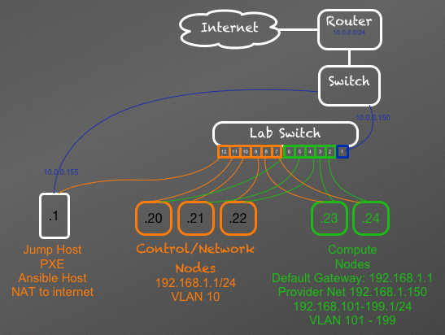

# My Openstack Lab

This lab is for my personal use.  

**NOTE:** Some of the config in this document will be moved to an ansible playbook later.  Until then its in here.  :)

# Connecting

You can use this to connect to the lab by adding this to ~/.ssh/config

```
Host lab
    HostName lab_ip_address_goes_here
    LocalForward 127.0.0.1:9080 10.0.0.150:80
    LocalForward 127.0.0.1:10010 192.168.1.20:80
    LocalForward 127.0.0.1:10011 192.168.1.20:443
    LocalForward 127.0.0.1:10020 192.168.1.21:80
    LocalForward 127.0.0.1:10021 192.168.1.21:443
    LocalForward 127.0.0.1:10030 192.168.1.22:80
    LocalForward 127.0.0.1:10031 192.168.1.22:443
    User lab
```

This will create ssh tunnel on your local host so you cna hit 127.0.0.1:9080 and get to the switch UI.
You can also access horizon on all three managment hosts. On respective ports.

## Screen

When connected to the lab you will want to use screen as the internet connection is of redentual grade and may drop.  Using screen should be very helpfull, because if you are dropped, log back in and re-attach to your screen.  Your terminal will continue as if you were not disconnected. Here are some nice screen commands that will help you if you are not a Screen Ninja

- List screen sessions ``` screen -ls ```
- Attach to the screen named lab ``` screeen -x lab ```
- Detach from a screen ``` CTRL a ``` then ``` CTRL D ```
- Create a new screen terminal ``` CTRL a ``` then ``` n ```
- While in screen see the other screens in a nice list ``` CTRL a ``` then ``` CTRL " ```
- Rename a screen session ``` CTRL a ``` then ``` SHIFT A ```
- Kill a screen ``` CTRL a ``` then ``` CTRL x ```
- Create a new screen with the name testing  ``` screen -S testing ```
- Kill a dead or unresponsive screen session ``` CTRL a ``` then ``` k ```
- Screen help ``` CTRL a ``` then ``` ? ```


Tips:

- Never ever run screen while in a screen!
- ``` CTRL A ``` should move you to the begening of a line.  not in screen!  instead use ``` CTRL a ``` then ``` a ```
- If your not sure you are in a screen use ``` CTRL a ``` then ``` ? ```  If you see a help window then you are.  
- Screen sessions are per user.  If you log in as bubba and do ```screen -ls ``` you will get a differnt list than if you did the same under root.


### Lab Screen

There should always be a lab screen running.  Log in under lab and run ``` screen -x lab ```


# Hardware

see [hardware.md](hardware.md)


# Network




**NOTE:** This diagram is out of date.  When we are done messing with the network it will be updated


You can access the swithc with
```
telnet 10.0.0.150

```

You can also connect to the web interface by connecting to the lab with a ssh prot fordwarding to 10.0.0.150:80

If you dont knwo the user and password then your out of luck.  ;)


## DHCP


DHCP is managed by systemctl

```
systemctl stop    isc-dhcp-server
systemctl start   isc-dhcp-server
systemctl status  isc-dhcp-server
systemctl restart isc-dhcp-server
```

There are Host directives in /etc/dhcp/dhcpd.conf that reserve an IP for each host in the lab.

This is the cureent configureation:

```
option domain-name "bitter.net";
option domain-name-servers 8.8.8.8, 4.4.4.4;
default-lease-time 600;
max-lease-time 7200;
log-facility local7;
ddns-update-style none;

host man1.oslab {
  hardware ethernet fc:aa:14:dc:95:d7;
  fixed-address 192.168.1.20;
        supersede host-name = "man1.oslab";
}
host man2.oslab {
  hardware ethernet fc:aa:14:dd:67:ee;
  fixed-address 192.168.1.21;
        supersede host-name = "man2.oslab";
}
host man3.oslab {
  hardware ethernet fc:aa:14:dc:94:aa;
  fixed-address 192.168.1.22;
        supersede host-name = "man3.oslab";
}

host comp1.oslab {
  hardware ethernet fc:aa:14:df:a8:32;
  fixed-address 192.168.1.23;
        supersede host-name = "comp1.oslab";
}
host comp2.oslab {
  hardware ethernet fc:aa:14:df:a7:c7;
  fixed-address 192.168.1.24;
        supersede host-name = "comp2.oslab";
}

subnet 192.168.1.0 netmask 255.255.255.0{
        range 192.168.1.30 192.168.1.39;
        option routers 192.168.1.1;
        server-identifier 192.168.1.1;
        next-server 192.168.1.1;
        filename "pxelinux.0";
}

```

For ease of use this is in /etc/hosts

```
192.168.1.20    man1.oslab
192.168.1.21    man2.oslab
192.168.1.22    man3.oslab

192.168.1.23    comp1.oslab
192.168.1.24    comp2.oslab

```

and /usr/lab/.ssh/config

```
StrictHostKeyChecking no


Host *.oslab
  User root

```


### PXE Booting 

I am using [PXEMonster](https://github.com/cbitter78/pxemonster) to create pxelinux.cfg files uing the ip address.  Post build the kick start will call pxemonister to remove the pxelinux.cfg file so on next boot it wont rebuild but will boot from local disk. 


To rebuild a host you use these commands (these will create a pxelinux file for 192.168.1.20 which should be control1.bitter.net.  Change the ip or passed in to define a differnt host)

```
curl -X POST "http://192.168.1.1:8080/pxe?spoof=192.168.1.20

```


```
/home/lab/pxelinux.cfg/prep_for_rebuild.sh 20
```
After you have run this script you will see a file prefixed with C0A8011 in /home/lab/pxelinux.cfg folder.   Jsut reboot the host and it will rebuld.

#### PXEMonster


PXE Monister is a docker container.  To see if its running you can 

```
docker ps

```

To restart it you can 

```
service docker restart
docker run -ti -d -p 192.168.1.1:8080:80 -v /var/lib/tftpboot/pxelinux.cfg:/pxelinux.cfg cbitter78/pxemonister:0.0.3-0

```

This is the /var/lib/tftpboot/pxemonster.yml file

```
---
- ip: 192.168.1.20
  pxe_template: ubuntu_1404.erb
  kickstart_url: http://192.168.1.1/ubuntu_14_04/ubuntu.ks
- ip: 192.168.1.21
  pxe_template: ubuntu_1404.erb
  kickstart_url: http://192.168.1.1/ubuntu_14_04/ubuntu.ks
- ip: 192.168.1.22
  pxe_template: ubuntu_1404.erb
  kickstart_url: http://192.168.1.1/ubuntu_14_04/ubuntu.ks
- ip: 192.168.1.23
  pxe_template: ubuntu_1404.erb
  kickstart_url: http://192.168.1.1/ubuntu_14_04/ubuntu.ks
- ip: 192.168.1.24
  pxe_template: ubuntu_1404.erb
  kickstart_url: http://192.168.1.1/ubuntu_14_04/ubuntu.ks

```

The ubuntu_1404.erb looks like this

```
default ubuntu1404

label ubuntu1404
  kernel ubuntu1404/linux
  append initrd=ubuntu1404/initrd.gz ks=<%= @host_info['kickstart_url'] %>
  prompt 0
  timeout 0

```

This is the kickstart

```
install
lang en_US
timezone America/New_York
keyboard us

# Networking
network --bootproto=dhcp --device=eth0
firewall --disabled

# Account setup
preseed user-setup/allow-password-weak boolean true
user ubuntu --fullname "Default user" --password=letmein

# After install, reboot
reboot

# Partitioning
# Clear master boot record
zerombr yes
# Delete all previous partitions
clearpart --all --initlabel

# LVM partitioning
preseed partman-auto/method string lvm
preseed partman-auto-lvm/guided_size string 28GB
preseed partman-auto/choose_recipe select atomic
preseed partman-lvm/device_remove_lvm boolean true

# Don't ask for confirmation for partitioning
preseed partman/confirm_write_new_label boolean true
preseed partman/choose_partition \
       select Finish partitioning and write changes to disk
preseed partman/confirm boolean true
preseed partman/confirm_nooverwrite boolean true

# Don't install recommended items by default
preseed base-installer/install-recommends boolean false

#Packages to install
%packages
ubuntu-minimal
openssh-server
screen
curl
wget
git
lvm2
python


# Install SSH keys
%post
mkdir -m 700 -p /home/ubuntu/.ssh/
echo "ssh-rsa AAAAB3NzaC1yc2EAAAADAQABAAABAQC/1Evy7FXfOpMiwYoJFsc2EG7X3xeEzzuExlU8bhiH24vMDN6aFPgAfawm1LJ43d7scW8GYn3sNWZBRNxo/yTI91EGL9eG+OMrTfaIQ1HPGffmLok87jznsL7k4PCSdYMNqnu175otuiDTr5l9rX0iUzlVqksUTdhUSTHjI7GILVV66FvV5TKJWQsufiwjewQLS0pDS0UxGCIV3IpjJxUvxpqAoAKMd7NIzdCmRYtlSpQYBbikCZj10Mw7tsZoGQvORU3c+2+hit/3vJ270cTt5DGZe02iwvee7USrxaupDM174YRnhSX3hZleEEnzpNM7DjdZt/V+00KXg129/OXh root@kangaroo1" > /home/ubuntu/.ssh/authorized_keys
echo "ssh-rsa AAAAB3NzaC1yc2EAAAADAQABAAABAQDMbl/20hYXBM5VsCU01zv4rc7coO8D5xE56j/GqTv/VJ+iEJrulU/it50SE08j80F++M2ARWN90X8q8I6J7AaIh3q4qZXK2qR3mTt8gD950Kst28x4UyM2XdkCR2T3315d250JQyR6hh8Z8Xzdqn1y/upUeWEdyUCevTl1mPi1XUKbB0qYoByn2MXWryw9hWwqqASE0ScRMKETIpQxw9VG7KbaImWMosYSJRZ2a10mNcrVWDbechO1YNYsLcdylXeD4zfkhK0Fq3VLUoGOrPDrlKW45A9u1b9G/CPgzmno5YFKrXBcCs/p6DYzhkGt+h2u4OUZtYhEY0/OJuCaQw5L lab@charles_lab" > /home/ubuntu/.ssh/authorized_keys
echo "ssh-rsa AAAAB3NzaC1yc2EAAAADAQABAAABAQDMbl/20hYXBM5VsCU01zv4rc7coO8D5xE56j/GqTv/VJ+iEJrulU/it50SE08j80F++M2ARWN90X8q8I6J7AaIh3q4qZXK2qR3mTt8gD950Kst28x4UyM2XdkCR2T3315d250JQyR6hh8Z8Xzdqn1y/upUeWEdyUCevTl1mPi1XUKbB0qYoByn2MXWryw9hWwqqASE0ScRMKETIpQxw9VG7KbaImWMosYSJRZ2a10mNcrVWDbechO1YNYsLcdylXeD4zfkhK0Fq3VLUoGOrPDrlKW45A9u1b9G/CPgzmno5YFKrXBcCs/p6DYzhkGt+h2u4OUZtYhEY0/OJuCaQw5L lab@charles_lab" > /root/.ssh/authorized_keys
chmod 600 /home/ubuntu/.ssh/authorized_keys
chown -R 1000:1000 /home/ubuntu

# Disable password for Sudo
echo 'ubuntu  ALL=(ALL:ALL) NOPASSWD: ALL' >> /etc/sudoers.d/ubuntu

# Only allow SSH keys
#sed -i 's/#PasswordAuthentication yes/PasswordAuthentication no' /etc/ssh/sshd_config

curl -X DELETE "http://192.168.1.1:8080/pxe"

# Avoid that last message about the install being complete.
preseed finish-install/reboot_in_progress note


```
